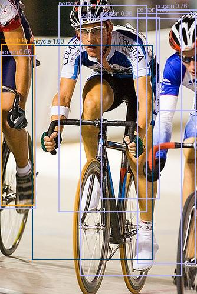

# MobileNetV2-SSD

Edge-oriented object detection pipeline built from first principles. Combines a MobileNetV2 backbone with an SSD (Single Shot MultiBox Detector) head for real-time inference on embedded hardware such as NVIDIA Jetson and Hailo.

Built with TensorFlow 2.17, trained on PASCAL VOC, and designed for reproducible, configuration-driven experimentation.

## Table of Contents

- [MobileNetV2-SSD](#mobilenetv2-ssd)
  - [Table of Contents](#table-of-contents)
  - [Architecture Overview](#architecture-overview)
  - [Project Structure](#project-structure)
  - [Getting Started](#getting-started)
    - [Prerequisites](#prerequisites)
    - [Install](#install)
    - [Quick Training Run](#quick-training-run)
  - [Configuration System](#configuration-system)
    - [Example experiment config](#example-experiment-config)
    - [Fingerprinting](#fingerprinting)
  - [Training](#training)
    - [Pipeline](#pipeline)
    - [Key features](#key-features)
    - [Training output](#training-output)
  - [Infrastructure](#infrastructure)
    - [Docker](#docker)
    - [Parallel experiments with Docker Compose](#parallel-experiments-with-docker-compose)
    - [S3 integration](#s3-integration)
    - [EC2 spot training with Terraform](#ec2-spot-training-with-terraform)
    - [Experiment Ledger (DynamoDB)](#experiment-ledger-dynamodb)
  - [Testing](#testing)
  - [Notebook-Driven Development](#notebook-driven-development)
  - [Deployment](#deployment)
    - [Export pipeline](#export-pipeline)
    - [Inference](#inference)
    - [Deploy config reference](#deploy-config-reference)
  - [Results](#results)
  - [Project Status](#project-status)

---

## Architecture Overview

```
Input Image [B, 300, 300, 3]
        │
        ▼
┌──────────────────┐
│  MobileNetV2     │   Inverted residual blocks with depthwise separable convolutions.
│  Backbone        │   Width multiplier (alpha) for model scaling.
│                  │   Outputs multi-scale features: C3, C4, C5
└──────┬───────────┘
       │
       ▼
┌──────────────────┐
│  Extra Feature   │   Stride-2 convolutions generating P6, P7, P8
│  Pyramid         │   for detecting objects at additional scales.
└──────┬───────────┘
       │
       ├──────────────────────┐
       ▼                      ▼
┌──────────────┐    ┌──────────────────┐
│ Localization │    │ Classification   │
│ Head         │    │ Head             │
│              │    │                  │
│ [B, N, 4]    │    │ [B, N, 21]       │
│ box offsets  │    │ class logits     │
└──────────────┘    └──────────────────┘
```

Six feature maps at different resolutions feed into shared-weight prediction heads. Prior (anchor) boxes are generated per feature map cell, and the network predicts offsets and class scores for each prior.

**Training pipeline:** Target assignment via IoU-based matching, hard negative mining (3:1 ratio), and MultiBox loss (smooth L1 + cross-entropy). Supports AMP (mixed precision), EMA (exponential moving average), and cosine-annealed learning rate with warmup.

---

## Project Structure

```
├── configs/                    # Hierarchical YAML configuration
│   ├── base/                   #   Reusable component defaults
│   │   ├── augmentations/      #     Data augmentation presets
│   │   ├── backbones/          #     MobileNetV2 config
│   │   ├── checkpoint/         #     Checkpoint retention policy
│   │   ├── heads/              #     SSD head architecture
│   │   ├── losses/             #     Loss function selection
│   │   ├── optimizers/         #     AdamW / SGD + schedulers
│   │   ├── priors/             #     Anchor box grid settings
│   │   └── ...
│   ├── data/                   #   Dataset configs (VOC 224 / 300)
│   ├── deploy/                 #   Edge deployment (Jetson TensorRT)
│   ├── engine/                 #   Training engine settings
│   ├── experiments/            #   Full experiment definitions
│   ├── model/                  #   End-to-end model configs
│   └── train/                  #   Training workflow configs
│
├── src/
│   ├── cli/                    # Entry points
│   │   ├── train.py            #   Main training CLI
│   │   ├── inference.py        #   SavedModel inference (image / webcam)
│   │   └── onnx_inference.py   #   ONNX inference — fp32 or int8 (image / webcam)
│   ├── deploy/                 # Export and deployment utilities
│   │   ├── __init__.py         #   load_deploy_config() shared loader
│   │   └── export/
│   │       ├── export.py       #     Checkpoint → SavedModel (with serve wrapper)
│   │       ├── convert.py      #     SavedModel → ONNX (tf2onnx)
│   │       ├── validate.py     #     ONNX shape + dtype validation
│   │       └── quantize.py     #     ONNX → INT8 QDQ (static calibration for TensorRT)
│   ├── datasets/               # Data loading and transforms
│   │   ├── voc.py              #   PASCAL VOC 2012 parser
│   │   ├── transforms.py       #   Augmentations (photometric, crop, flip)
│   │   └── collate.py          #   tf.data pipeline creation
│   ├── infrastructure/         # Cloud utilities
│   │   ├── s3_sync.py          #   S3 checkpoint upload / download
│   │   └── dynamodb_ledger.py  #   Atomic experiment state machine
│   ├── mobilenetv2ssd/
│   │   ├── core/               # Shared utilities
│   │   │   ├── config.py       #     Hierarchical config loader
│   │   │   ├── fingerprint.py  #     Reproducibility hash
│   │   │   ├── logger.py       #     Structured logging + TensorBoard
│   │   │   └── precision.py    #     FP32 enforcement for sensitive ops
│   │   └── models/
│   │       ├── mobilenet_v2/   #     Backbone (inverted residuals)
│   │       ├── ssd/            #     Heads, priors, matching, losses, NMS
│   │       └── factory.py      #     Model builder
│   └── training/               # Training loop
│       ├── engine.py           #   fit(), train_one_epoch(), training_step()
│       ├── optimizer.py        #   Optimizer factory
│       ├── schedule.py         #   LR warmup + cosine annealing
│       ├── amp.py              #   Mixed precision context
│       ├── ema.py              #   Exponential moving average
│       ├── checkpoints.py      #   Save / restore state
│       ├── resume.py           #   Resume from local or S3 checkpoint
│       └── metrics.py          #   VOC mAP @ 0.5
│
├── infrastructure/             # Cloud deployment
│   ├── main.tf                 #   Terraform: provider + backend
│   ├── training.tf             #   EC2 spot instance request
│   ├── iam.tf                  #   IAM role with S3 + DynamoDB permissions
│   ├── dynamodb.tf             #   DynamoDB table data block (read-only lookup)
│   ├── schedule.tf             #   null_resource: runs scheduler on apply
│   ├── variables.tf            #   Input variables
│   ├── QUICKSTART.md           #   Step-by-step EC2 training guide
│   └── DOCKER_USAGE.md         #   Docker / docker-compose guide
│
├── scripts/
│   ├── schedule_experiments.py #   Register experiments in DynamoDB ledger
│   ├── create_tfrecords.py     #   Convert VOC dataset to TFRecords
│   ├── export_model.py         #   One-off: S3 checkpoint → SavedModel export
│   └── onnx_inference.py       #   One-off: ONNX model inference check
│
├── tests/
│   ├── unit/                   # 12 unit test modules
│   └── integration/            # Multi-component integration tests
│
├── notebooks/                  # Notebook-driven development (see below)
├── Dockerfile                  # TF 2.17-gpu training image
├── Dockerfile.tensorboard      # TensorBoard S3-sync image
├── docker-compose.yml          # Parallel experiments + monitoring
├── Makefile                    # dev, test, lint, format shortcuts
└── pyproject.toml              # Project metadata and dependencies
```

---

## Getting Started

### Prerequisites

- Python 3.10+
- TensorFlow 2.17.0 (GPU recommended)
### Install

```bash
# Production dependencies
pip install -e .

# With dev tools (pytest, coverage)
pip install -e ".[dev]"

# With cloud support (boto3 for S3)
pip install -e ".[cloud]"

# With ONNX export tools (convert, validate, quantize)
pip install -e ".[onnx-export]"
```

### Quick Training Run

```bash
python -m cli.train \
  --experiment_path configs/experiments/exp001_baseline.yaml \
  --config_root configs/
```

Useful flags:

| Flag | Purpose |
|------|---------|
| `--resume` | Resume from the latest checkpoint in the run directory |
| `--run_from <path>` | Resume from a specific checkpoint (local path or `s3://...`) |
| `--print_config` | Print the fully merged config and exit |
| `--dry_run` | Initialize everything (model, data, optimizer) without training |

---

## Configuration System

Configs are hierarchical YAML files merged at runtime. An experiment config references base component configs and can override any value.

```
configs/experiments/exp001_baseline.yaml
        │
        │  defaults:
        │    backbone: base/backbones/mobilenetv2.yaml
        │    train:    base/train/default.yaml
        │    losses:   base/losses/ssd_loss.yaml
        │    ...
        │
        ▼
   Merged Config  ◄── CLI overrides (key.path=value)
                  ◄── Environment variables (${VAR:-default})
```

### Example experiment config

```yaml
experiment:
  id: exp001
  name: mobilenetv2_ssd_baseline
  tags: [baseline, mobilenetv2, voc]

defaults:
  backbone: base/backbones/mobilenetv2.yaml
  train: base/train/default.yaml
  optimizer: base/optimizers/adamw_cosine.yaml
  losses: base/losses/ssd_loss.yaml

overrides:
  train:
    epochs: 50
    batch_size: 3
```

### Fingerprinting

Each run is fingerprinted by hashing the architecture-defining config keys (backbone, heads, priors, num classes, input size). This produces a deterministic run directory name like `exp001_a1b2c3d4` and enables automatic checkpoint compatibility validation when resuming.

---

## Training

### Pipeline

1. **Config merge** — experiment YAML + base defaults + CLI overrides
2. **Fingerprint** — hash architecture params for the run directory
3. **Dataset creation** — VOC parser, transforms, `tf.data` pipeline with padding and prefetch
4. **Prior generation** — anchor boxes at 6 scales with configurable aspect ratios
5. **Model build** — backbone feature extraction, extra pyramid levels, prediction heads
6. **Optimizer + scheduler** — AdamW (or SGD) with linear warmup + cosine annealing
7. **Training loop** — `tf.GradientTape`, AMP autocast, EMA updates, per-epoch checkpointing
8. **Evaluation** — VOC mAP @ IoU 0.5, best-metric checkpointing
9. **S3 sync** — upload checkpoints, logs, and metrics after each epoch

### Key features

- **Mixed precision (AMP):** `mixed_float16` policy with dynamic loss scaling. Sensitive operations (loss reduction, NMS, IoU) are forced to FP32.
- **EMA:** Exponential moving average of model weights with configurable decay and warmup period. EMA weights can be used for evaluation.
- **Hard negative mining:** Selects the hardest negative priors at a configurable ratio (default 3:1) to balance the classification loss.
- **Graceful shutdown:** Catches SIGTERM, saves a checkpoint, uploads to S3, and writes a `status.json` before exiting.

### Training output

```
runs/
└── exp001_a1b2c3d4/
    ├── config.json           # Full merged config snapshot
    ├── fingerprint.json      # Architecture hash
    ├── status.json           # success | failed
    ├── args.json             # CLI arguments
    └── logs/
        └── <timestamp>/
            ├── training.log
            ├── metric_history.json
            └── events.out.tfevents.*   # TensorBoard
```

---

## Infrastructure

### Docker

Two container images are provided:

| Image | Base | Purpose |
|-------|------|---------|
| `Dockerfile` | `tensorflow/tensorflow:2.17.0-gpu` | Training with GPU support |
| `Dockerfile.tensorboard` | — | TensorBoard syncing logs from S3 |

### Parallel experiments with Docker Compose

```
┌──────────────────┐
│   TensorBoard    │ ◄── syncs from S3 every 60s
│   localhost:6006 │
└────────┬─────────┘
         │
    ┌────┴────┐
    │   S3    │
    └────┬────┘
         │ uploads after each epoch
    ┌────┴────┬──────────┐
    │         │          │
┌───┴───┐ ┌──┴────┐  ┌───┴───┐
│exp001 │ │exp002 │  │exp003 │   ← one GPU each
│GPU 0  │ │GPU 1  │  │GPU 2  │
└───────┘ └───────┘  └───────┘
```

```bash
# Set environment
cp .env.example .env    # fill in AWS creds + dataset path

# Launch everything
docker-compose up -d

# Watch a specific experiment
docker-compose logs -f training-exp001

# Monitor in browser
# http://localhost:6006

# Tear down
docker-compose down
```

Add more experiments by duplicating a service block in `docker-compose.yml` with a different GPU ID and experiment config.

### S3 integration

The training loop automatically syncs to S3 when credentials are configured:

- **Upload:** checkpoints, logs, and metrics after each epoch
- **Download:** restore checkpoints for resuming (`--run_from s3://bucket/path`)
- **TensorBoard:** the TensorBoard container polls S3 and serves logs locally

### EC2 spot training with Terraform

The `infrastructure/` directory contains Terraform configs for launching GPU spot instances:

```bash
cd infrastructure/
terraform init
terraform plan     # preview (no cost)
terraform apply    # launches g4dn.2xlarge on-demand (~$0.75/hr)

# When done:
terraform destroy  # stops billing, keeps S3 data
```

The instance bootstraps automatically: installs NVIDIA toolkit, pulls the Docker image, downloads the dataset from S3, and starts training. See [infrastructure/QUICKSTART.md](infrastructure/QUICKSTART.md) for the full walkthrough.

### Experiment Ledger (DynamoDB)

An atomic experiment tracking table prevents duplicate runs, enables spot preemption recovery, and gives a live view of experiment status across all instances.

**State machine:**

```
pending ──► running ──► success
                │
                └──► failed ──► running   (on next terraform apply)
```

**Setup:** The DynamoDB table (`ml-experiment-ledger`) is created manually and looked up read-only by Terraform. Primary key is `experiment_id` (e.g. `exp002`), sort key is `fingerprint` (12-char hash of the config).

**Registering experiments:**

```bash
# Preview what would be registered (no writes)
python scripts/schedule_experiments.py --dry_run

# Register all enabled experiment YAMLs in configs/experiments/
python scripts/schedule_experiments.py --table_name ml-experiment-ledger --region us-east-1

# Or: terraform apply automatically runs the scheduler before launching EC2
# (via null_resource.schedule_experiments in infrastructure/schedule.tf)
```

**Monitoring:**

```bash
# Print live table state
python scripts/schedule_experiments.py --list

# Example output:
# ID         FINGERPRINT    STATUS     PRIORITY   STEPS    METRIC     INSTANCE
# ------------------------------------------------------------------------
# exp002     cf4c2c8c1536   running    200        12400    -          i-0abc123
# exp001     761101dca987   success    100        72200    0.7341     i-0def456
```

**Recovering from spot preemption:**

```bash
# Reset a failed experiment back to pending
python scripts/schedule_experiments.py --reset_failed exp002

# Then re-apply Terraform — the new instance will resume from the last S3 checkpoint
terraform apply
```

**How it links to training:** When `train.py` starts on EC2, it reads `DYNAMODB_EXPERIMENT_TABLE` and `AWS_DEFAULT_REGION` from the environment (injected by `user_data.sh`), looks up the experiment by `(experiment_id, fingerprint)`, and atomically claims it using a conditional write. If the experiment is `failed` and has a `checkpoint_s3_path`, it downloads that checkpoint and resumes automatically. On success or failure, the ledger is updated in the `finally` block with the final state, step count, and best metric.

**Fingerprint stability:** Path keys (`root`, `classes_file`, etc.) are stripped from the config before hashing so that fingerprints are identical regardless of where the config is loaded from (local machine vs. Docker container on EC2).

---

## Testing

```bash
make test               # unit tests (default)
make test-integration   # integration tests
make test-all           # everything
make test-cov           # unit tests with coverage
```

Unit tests cover all core components:

| Module | What it tests |
|--------|--------------|
| `test_backbone_tf` | MobileNetV2 output shapes and feature extraction |
| `test_heads_tf` | Classification / localization head outputs |
| `test_priors_ops_tf` | Anchor grid generation |
| `test_match_ops_tf` | Prior-to-ground-truth IoU matching |
| `test_encode_ops_tf` | Box coordinate encoding / decoding |
| `test_box_ops_tf` | Box format conversions |
| `test_loss_ops_tf` | Loss function values |
| `test_postprocess_ops_tf` | NMS and detection decoding |
| `test_metrics_tf` | mAP computation |
| `test_amp_tf` | Mixed precision context and loss scaling |

---

## Notebook-Driven Development

Every component was implemented and validated in a Jupyter notebook before being promoted to `src/`. This ensures correctness through visualization and incremental testing.

**Core primitives (01-08):** Backbone verification, bounding box ops, encoding logic, SSD heads.

**Orchestration layer (09-13):** Prior/anchor grid visualization, ground-truth matching, hard negative mining ratios, MultiBox loss convergence.

**System integration (14-25):** Model factory, post-processing (NMS + decoding), metrics manager, LR scheduler, checkpoint manager, training step, full SSD forward pass.

---

## Deployment

A single deploy config (`configs/deploy/mobilenetv2_ssd_voc_jetson.yaml`) drives the entire export and inference pipeline — no hardcoded paths or thresholds.

### Export pipeline

Two virtual environments are required (TF ops and ONNX conversion conflict):

```
tf-gpu venv          onnx-export venv
─────────────        ──────────────────────────────────────────────────────
export.py        →   convert.py  →  validate.py  →  quantize.py
(checkpoint           (SavedModel     (ONNX shape      (INT8 QDQ calibration
 → SavedModel)         → ONNX)        assertion          → model_int8.onnx)
                                       → PASS)
```

```bash
# 1. Export SavedModel from checkpoint (tf-gpu venv)
PYTHONPATH=src python src/deploy/export/export.py \
  --deploy_config configs/deploy/mobilenetv2_ssd_voc_jetson.yaml \
  --checkpoint path/to/ckpt
# → exported_model/saved_model/
# → exported_model/priors_cxcywh.npy

# 2. Convert to ONNX (onnx-export venv)
PYTHONPATH=src python src/deploy/export/convert.py \
  --deploy_config configs/deploy/mobilenetv2_ssd_voc_jetson.yaml
# → exported_model/model.onnx

# 3. Validate ONNX output shapes (onnx-export venv)
PYTHONPATH=src python src/deploy/export/validate.py \
  --deploy_config configs/deploy/mobilenetv2_ssd_voc_jetson.yaml
# → PASS

# 4. Quantize to INT8 (onnx-export venv)
PYTHONPATH=src python src/deploy/export/quantize.py \
  --deploy_config configs/deploy/mobilenetv2_ssd_voc_jetson.yaml \
  --calibration_images datasets/VOCdevkit/VOC2012/JPEGImages/
# → exported_model/model_int8.onnx
```

The SavedModel serve wrapper bakes in normalization (mean/std), box decoding (cxcywh → xyxy), and softmax — so the ONNX model takes raw `[0, 1]` float32 images and outputs decoded boxes and class scores directly.

**ONNX outputs:**

| Tensor | Shape | Description |
|--------|-------|-------------|
| `boxes` | `(B, 13502, 4)` | xyxy normalized |
| `scores` | `(B, 13502, 21)` | softmax class probabilities |

### Inference

```bash
# Image inference (tf-gpu venv)
PYTHONPATH=src python src/cli/inference.py \
  --deploy_config configs/deploy/mobilenetv2_ssd_voc_jetson.yaml \
  --image path/to/image.jpg

# Directory of images
PYTHONPATH=src python src/cli/inference.py \
  --deploy_config configs/deploy/mobilenetv2_ssd_voc_jetson.yaml \
  --image datasets/VOCdevkit/VOC2012/JPEGImages/

# Live webcam (index or MJPEG URL)
PYTHONPATH=src python src/cli/inference.py \
  --deploy_config configs/deploy/mobilenetv2_ssd_voc_jetson.yaml \
  --webcam --camera 0

# One-off ONNX check (onnx-export venv)
PYTHONPATH=src python scripts/onnx_inference.py
```

Annotated outputs are saved to `inference_out/` by default.

### Deploy config reference

```yaml
# configs/deploy/mobilenetv2_ssd_voc_jetson.yaml
deploy:
  input:
    size: [300, 300, 3]
  post_processing:
    score_threshold: 0.35
    nms_iou_threshold: 0.5
    max_detections: 20
  runtime:
    precision: FP16
    batch_size: 1
    opset: 17
```

---

## Results

### Example detections — Pascal VOC (SavedModel, score threshold 0.35)



*Cyclists detected in a cluttered scene: 6 × person, 1 × bicycle, 1 × motorbike — all at high confidence.*

### Metrics

*Coming soon.*

---

## Project Status

This project is under active development. See [IMPLEMENTATION_ROADMAP.md](IMPLEMENTATION_ROADMAP.md) for a detailed breakdown of completed, in-progress, and planned work.

**Completed:** Core SSD architecture, training pipeline with AMP/EMA, checkpoint management with S3 resume, Docker + Terraform infrastructure, configuration system, VOC mAP evaluation, DynamoDB experiment ledger with atomic claiming, spot preemption recovery, Terraform-integrated scheduling, SavedModel export, ONNX conversion and validation, static INT8 QDQ quantization (TensorRT-compatible), and image/webcam inference CLI.

**Planned:** COCO mAP metrics, quantization-aware training, multi-scale training, ROS2 runtime integration.
