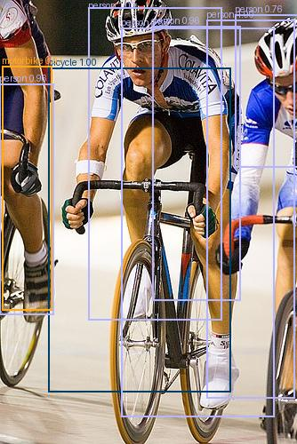

# MobileNetV2-SSD

> End-to-end object detection training and deployment system with reproducible experiments and cloud-scale infrastructure.

End-to-end object detection system built from scratch, combining a MobileNetV2 backbone with an SSD head for training, evaluation, and deployment on embedded and cloud platforms.

Built with TensorFlow 2.17, trained on PASCAL VOC, and designed for reproducible, configuration-driven experimentation.

## What This Project Demonstrates

- Built end-to-end ML system: data ingestion, training, evaluation, and deployment
- Designed distributed experimentation platform on AWS with Docker and Terraform
- Implemented reproducible ML workflows with configuration-driven experiments and fingerprinting
- Optimized training and deployment for real-world use, including ONNX export and INT8 quantization

---

## Results

### Example detections — Pascal VOC (SavedModel)



*Detection output showing multiple cyclists with overlapping objects, demonstrating robust multi-object detection in cluttered scenes.*

### Metrics

| Model | Dataset | Epochs | mAP@0.5 |
|-------|---------|--------|---------|
| MobileNetV2-SSD | Pascal VOC 2012 | 200 | **76.6%** |

Evaluated with VOC mAP @ IoU 0.5. Per-class AP breakdown coming soon.

---

## Table of Contents

- [MobileNetV2-SSD](#mobilenetv2-ssd)
  - [Table of Contents](#table-of-contents)
  - [Architecture Overview](#architecture-overview)
  - [Project Structure](#project-structure)
  - [Getting Started](#getting-started)
    - [Prerequisites](#prerequisites)
    - [Install](#install)
    - [Quick Training Run](#quick-training-run)
  - [Configuration System](#configuration-system)
    - [Example experiment config](#example-experiment-config)
    - [Fingerprinting](#fingerprinting)
  - [Training](#training)
    - [Pipeline](#pipeline)
    - [Key features](#key-features)
    - [Training output](#training-output)
  - [ETL Data Pipeline](#etl-data-pipeline)
    - [Overview](#etl-overview)
    - [Multi-Model Detection](#multi-model-detection)
    - [Consensus Engine](#consensus-engine)
    - [Airflow Orchestration](#airflow-orchestration)
    - [Running the ETL locally](#running-the-etl-locally)
    - [ETL Configuration](#etl-configuration)
  - [Infrastructure](#infrastructure)
    - [Docker](#docker)
    - [Parallel experiments with Docker Compose](#parallel-experiments-with-docker-compose)
    - [S3 integration](#s3-integration)
    - [EC2 spot training with Terraform](#ec2-spot-training-with-terraform)
    - [Experiment Ledger (DynamoDB)](#experiment-ledger-dynamodb)
  - [Training Orchestration (Control Plane)](#training-orchestration-control-plane)
    - [End-to-end flow](#end-to-end-flow)
    - [API endpoints](#api-endpoints)
    - [Config library on S3](#config-library-on-s3)
    - [The training\_pipeline DAG](#the-training_pipeline-dag)
    - [Self-reporting instances](#self-reporting-instances)
  - [Dashboard](#dashboard)
    - [Views](#views)
    - [Running the dashboard](#running-the-dashboard)
    - [Frontend tests](#frontend-tests)
  - [Testing](#testing)
  - [Notebook-Driven Development](#notebook-driven-development)
  - [Deployment](#deployment)
    - [Export pipeline](#export-pipeline)
    - [Inference](#inference)
    - [Deploy config reference](#deploy-config-reference)
  - [Results](#results)
    - [Example detections — Pascal VOC (SavedModel)](#example-detections--pascal-voc-savedmodel)
    - [Metrics](#metrics)
  - [Project Status](#project-status)

---

## Architecture Overview

```
Input Image [B, 300, 300, 3]
        │
        ▼
┌──────────────────┐
│  MobileNetV2     │   Inverted residual blocks with depthwise separable convolutions.
│  Backbone        │   Width multiplier (alpha) for model scaling.
│                  │   Outputs multi-scale features: C3, C4, C5
└──────┬───────────┘
       │
       ▼
┌──────────────────┐
│  Extra Feature   │   Stride-2 convolutions generating P6, P7, P8
│  Pyramid         │   for detecting objects at additional scales.
└──────┬───────────┘
       │
       ├──────────────────────┐
       ▼                      ▼
┌──────────────┐    ┌──────────────────┐
│ Localization │    │ Classification   │
│ Head         │    │ Head             │
│              │    │                  │
│ [B, N, 4]    │    │ [B, N, 21]       │
│ box offsets  │    │ class logits     │
└──────────────┘    └──────────────────┘
```

Six feature maps at different resolutions feed into shared-weight prediction heads. Prior (anchor) boxes are generated per feature map cell, and the network predicts offsets and class scores for each prior.

**Training pipeline:** Target assignment via IoU-based matching, hard negative mining (3:1 ratio), and MultiBox loss (smooth L1 + cross-entropy). Supports AMP (mixed precision), EMA (exponential moving average), and cosine-annealed learning rate with warmup.

---

## Project Structure

```
├── configs/                    # Hierarchical YAML configuration
│   ├── base/                   #   Reusable component defaults
│   │   ├── augmentations/      #     Data augmentation presets
│   │   ├── backbones/          #     MobileNetV2 config
│   │   ├── checkpoint/         #     Checkpoint retention policy
│   │   ├── heads/              #     SSD head architecture
│   │   ├── losses/             #     Loss function selection
│   │   ├── optimizers/         #     AdamW / SGD + schedulers
│   │   ├── priors/             #     Anchor box grid settings
│   │   └── ...
│   ├── data/                   #   Dataset configs (VOC 224 / 300)
│   ├── deploy/                 #   Edge deployment (Jetson TensorRT)
│   ├── engine/                 #   Training engine settings
│   ├── experiments/            #   Full experiment definitions
│   ├── model/                  #   End-to-end model configs
│   └── train/                  #   Training workflow configs
│
├── src/
│   ├── cli/                    # Entry points
│   │   ├── train.py            #   Main training CLI
│   │   ├── inference.py        #   SavedModel inference (image / webcam)
│   │   ├── onnx_inference.py   #   ONNX inference — fp32 or int8 (image / webcam)
│   │   └── etl.py              #   ETL pipeline entry point
│   ├── etl/                    # ETL pipeline components
│   │   ├── detectors.py        #   YOLOv8, RT-DETR, Grounding DINO wrappers
│   │   ├── consensus.py        #   Multi-model vote merging + IoU NMS
│   │   ├── frame_sampler.py    #   Stride + scene-change frame selection
│   │   ├── writer.py           #   TFRecord shard writer
│   │   ├── pipeline.py         #   Ray actor: per-video orchestration
│   │   ├── runner.py           #   Ray cluster init + job dispatch
│   │   └── db.py               #   SQLAlchemy models (Video, Frame, Annotation)
│   ├── deploy/                 # Export and deployment utilities
│   │   ├── __init__.py         #   load_deploy_config() shared loader
│   │   └── export/
│   │       ├── export.py       #     Checkpoint → SavedModel (with serve wrapper)
│   │       ├── convert.py      #     SavedModel → ONNX (tf2onnx)
│   │       ├── validate.py     #     ONNX shape + dtype validation
│   │       └── quantize.py     #     ONNX → INT8 QDQ (static calibration for TensorRT)
│   ├── datasets/               # Data loading and transforms
│   │   ├── voc.py              #   PASCAL VOC 2012 parser
│   │   ├── transforms.py       #   Augmentations (photometric, crop, flip)
│   │   └── collate.py          #   tf.data pipeline creation
│   ├── infrastructure/         # Cloud utilities
│   │   ├── s3_sync.py          #   S3 checkpoint upload / download
│   │   └── dynamodb_ledger.py  #   Atomic experiment state machine
│   ├── mobilenetv2ssd/
│   │   ├── core/               # Shared utilities
│   │   │   ├── config.py       #     Hierarchical config loader
│   │   │   ├── fingerprint.py  #     Reproducibility hash
│   │   │   ├── logger.py       #     Structured logging + TensorBoard
│   │   │   └── precision.py    #     FP32 enforcement for sensitive ops
│   │   └── models/
│   │       ├── mobilenet_v2/   #     Backbone (inverted residuals)
│   │       ├── ssd/            #     Heads, priors, matching, losses, NMS
│   │       └── factory.py      #     Model builder
│   └── training/               # Training loop
│       ├── engine.py           #   fit(), train_one_epoch(), training_step()
│       ├── optimizer.py        #   Optimizer factory
│       ├── schedule.py         #   LR warmup + cosine annealing
│       ├── amp.py              #   Mixed precision context
│       ├── ema.py              #   Exponential moving average
│       ├── checkpoints.py      #   Save / restore state
│       ├── resume.py           #   Resume from local or S3 checkpoint
│       └── metrics.py          #   VOC mAP @ 0.5
│
├── infrastructure/             # Cloud deployment
│   ├── main.tf                 #   Terraform: provider + backend
│   ├── training.tf             #   EC2 spot instance request
│   ├── iam.tf                  #   IAM role with S3 + DynamoDB permissions
│   ├── dynamodb.tf             #   DynamoDB table data block (read-only lookup)
│   ├── user_data.sh            #   Instance bootstrap: pull image, config, shards; run training
│   ├── variables.tf            #   Input variables
│   ├── QUICKSTART.md           #   Step-by-step EC2 training guide
│   └── DOCKER_USAGE.md         #   Docker / docker-compose guide
│
├── scripts/
│   ├── export_pipeline.sh      #   Full export pipeline: checkpoint → SavedModel → ONNX → INT8 (S3 or local)
│   ├── compare_inference.sh    #   Run SavedModel / FP32 / INT8 on the same images and diff results
│   ├── schedule_experiments.py #   Register experiments in DynamoDB ledger
│   ├── create_tfrecords.py     #   Convert VOC dataset to TFRecords
│   └── export_model.py         #   One-off: S3 checkpoint → SavedModel export
│
├── tests/
│   ├── unit/                   # 12 unit test modules
│   └── integration/            # Multi-component integration tests
│
├── notebooks/                  # Notebook-driven development (see below)
├── api/                        # FastAPI control-plane backend
│   ├── main.py                 #   App: routers, CORS, static UI, config-library sync on startup
│   ├── config.py               #   Buckets, region, table, infra/config dirs, DB URLs
│   ├── routers/
│   │   ├── experiments.py      #     register / preview / list / reset / config-library
│   │   └── training.py         #     launch (triggers DAG) / stop / instance status
│   └── services/
│       ├── experiments.py      #     register_experiments(): resolve → fingerprint → S3 + ledger
│       ├── fingerprint.py      #     TF-free fingerprint helper (dedup key)
│       ├── config_library.py   #     S3 ⇄ local base-config sync + upload
│       ├── ledger.py           #     DynamoDB ledger accessor
│       └── ec2.py              #     Instance describe / stop / TensorBoard URL
├── dags/
│   ├── etl_pipeline.py         # Airflow DAG: ETL provision → run → teardown → notify
│   └── training_pipeline.py    # Airflow DAG: check → launch → wait → teardown → email
├── ui/                         # Dashboard frontend
│   ├── src/                    #   React + TypeScript components (Vite)
│   │   ├── components/         #     Pipeline, Metrics, ETL, Ops, Deploy, Config views
│   │   └── api/                #     Typed fetch client + usePolling hook
│   ├── tests/                  #   Jest + React Testing Library (~160 tests)
│   ├── package.json
│   └── tsconfig.json
├── docker/
│   ├── Dockerfile.etl          # ETL worker image (PyTorch + ultralytics + TF + Ray)
│   └── Dockerfile.dashboard    # Multi-stage: Node (Vite build) + Python (FastAPI + static)
├── Dockerfile                  # TF 2.17-gpu training image
├── Dockerfile.tensorboard      # TensorBoard S3-sync image
├── docker-compose.yml          # Dashboard (API + UI), Airflow, Postgres, ETL
├── Makefile                    # dev, test, lint, format shortcuts
└── pyproject.toml              # Project metadata and dependencies
```

---

## Getting Started

### Prerequisites

- Python 3.10+
- TensorFlow 2.17.0 (GPU recommended)
### Install

```bash
# Production dependencies
pip install -e .

# With dev tools (pytest, coverage)
pip install -e ".[dev]"

# With cloud support (boto3 for S3)
pip install -e ".[cloud]"

# With ONNX export tools (convert, validate, quantize)
pip install -e ".[onnx-export]"
```

### Quick Training Run

```bash
python -m cli.train \
  --experiment_path configs/experiments/exp001_baseline.yaml \
  --config_root configs/
```

Useful flags:

| Flag | Purpose |
|------|---------|
| `--resume` | Resume from the latest checkpoint in the run directory |
| `--run_from <path>` | Resume from a specific checkpoint (local path or `s3://...`) |
| `--print_config` | Print the fully merged config and exit |
| `--dry_run` | Initialize everything (model, data, optimizer) without training |

---

## Configuration System

Configs are hierarchical YAML files merged at runtime. An experiment config references base component configs and can override any value.

```
configs/experiments/exp001_baseline.yaml
        │
        │  defaults:
        │    backbone: base/backbones/mobilenetv2.yaml
        │    train:    base/train/default.yaml
        │    losses:   base/losses/ssd_loss.yaml
        │    ...
        │
        ▼
   Merged Config  ◄── CLI overrides (key.path=value)
                  ◄── Environment variables (${VAR:-default})
```

### Example experiment config

```yaml
experiment:
  id: exp001
  name: mobilenetv2_ssd_baseline
  tags: [baseline, mobilenetv2, voc]

defaults:
  backbone: base/backbones/mobilenetv2.yaml
  train: base/train/default.yaml
  optimizer: base/optimizers/adamw_cosine.yaml
  losses: base/losses/ssd_loss.yaml

overrides:
  train:
    epochs: 50
    batch_size: 3
```

### Fingerprinting

Each run is fingerprinted by hashing the architecture-defining config keys (backbone, heads, priors, num classes, input size). This produces a deterministic run directory name like `exp001_a1b2c3d4` and enables automatic checkpoint compatibility validation when resuming.

---

## Training

### Pipeline

1. **Config merge** — experiment YAML + base defaults + CLI overrides
2. **Fingerprint** — hash architecture params for the run directory
3. **Dataset creation** — VOC parser, transforms, `tf.data` pipeline with padding and prefetch
4. **Prior generation** — anchor boxes at 6 scales with configurable aspect ratios
5. **Model build** — backbone feature extraction, extra pyramid levels, prediction heads
6. **Optimizer + scheduler** — AdamW (or SGD) with linear warmup + cosine annealing
7. **Training loop** — `tf.GradientTape`, AMP autocast, EMA updates, per-epoch checkpointing
8. **Evaluation** — VOC mAP @ IoU 0.5, best-metric checkpointing
9. **S3 sync** — upload checkpoints, logs, and metrics after each epoch

### Key features

- **Mixed precision (AMP):** `mixed_float16` policy with dynamic loss scaling. Sensitive operations (loss reduction, NMS, IoU) are forced to FP32.
- **EMA:** Exponential moving average of model weights with configurable decay and warmup period. EMA weights can be used for evaluation.
- **Hard negative mining:** Selects the hardest negative priors at a configurable ratio (default 3:1) to balance the classification loss.
- **Graceful shutdown:** Catches SIGTERM, saves a checkpoint, uploads to S3, and writes a `status.json` before exiting.

### Training output

```
runs/
└── exp001_a1b2c3d4/
    ├── config.json           # Full merged config snapshot
    ├── fingerprint.json      # Architecture hash
    ├── status.json           # success | failed
    ├── args.json             # CLI arguments
    └── logs/
        └── <timestamp>/
            ├── training.log
            ├── metric_history.json
            └── events.out.tfevents.*   # TensorBoard
```

---

## Infrastructure

### Docker

Two container images are provided:

| Image | Base | Purpose |
|-------|------|---------|
| `Dockerfile` | `tensorflow/tensorflow:2.17.0-gpu` | Training with GPU support |
| `Dockerfile.tensorboard` | — | TensorBoard syncing logs from S3 |
| `docker/Dockerfile.dashboard` | Node 22 + Python 3.12 | Vite frontend build + FastAPI dashboard server |
| `docker/Dockerfile.etl` | PyTorch + ultralytics | ETL worker (YOLOv8, RT-DETR, Grounding DINO, Ray) |

### Parallel experiments with Docker Compose

```
┌──────────────────┐
│   TensorBoard    │ ◄── syncs from S3 every 60s
│   localhost:6006 │
└────────┬─────────┘
         │
    ┌────┴────┐
    │   S3    │
    └────┬────┘
         │ uploads after each epoch
    ┌────┴────┬──────────┐
    │         │          │
┌───┴───┐ ┌──┴────┐  ┌───┴───┐
│exp001 │ │exp002 │  │exp003 │   ← one GPU each
│GPU 0  │ │GPU 1  │  │GPU 2  │
└───────┘ └───────┘  └───────┘
```

```bash
# Set environment
cp .env.example .env    # fill in AWS creds + dataset path

# Launch everything
docker-compose up -d

# Watch a specific experiment
docker-compose logs -f training-exp001

# Monitor in browser
# http://localhost:6006

# Tear down
docker-compose down
```

Add more experiments by duplicating a service block in `docker-compose.yml` with a different GPU ID and experiment config.

### S3 integration

The training loop automatically syncs to S3 when credentials are configured:

- **Upload:** checkpoints, logs, and metrics after each epoch
- **Download:** restore checkpoints for resuming (`--run_from s3://bucket/path`)
- **TensorBoard:** the TensorBoard container polls S3 and serves logs locally

### EC2 spot training with Terraform

The `infrastructure/` directory contains Terraform configs for launching GPU spot instances:

```bash
cd infrastructure/
terraform init
terraform plan     # preview (no cost)
terraform apply    # launches g4dn.2xlarge on-demand (~$0.75/hr)

# When done:
terraform destroy  # stops billing, keeps S3 data
```

The instance bootstraps automatically: installs NVIDIA toolkit, pulls the Docker image, downloads the dataset from S3, and starts training. See [infrastructure/QUICKSTART.md](infrastructure/QUICKSTART.md) for the full walkthrough.

### Experiment Ledger (DynamoDB)

An atomic experiment tracking table prevents duplicate runs, enables spot preemption recovery, and gives a live view of experiment status across all instances.

**State machine:**

```
pending ──► running ──► success
                │
                └──► failed ──► pending   (reset via API / CLI, then re-launch)
```

The ledger doubles as a **work queue**: the API writes a `pending` row, and the EC2 instance atomically claims it (`pending → running`) on boot. See [Training Orchestration](#training-orchestration-control-plane) for the full API → DAG → instance flow.

**Setup:** The DynamoDB table (`ml-experiment-ledger`) is created manually and looked up read-only by Terraform. Primary key is `experiment_id` (e.g. `exp002`), sort key is `fingerprint` (12-char hash of the config).

**Registering experiments:**

```bash
# Preview what would be registered (no writes)
python scripts/schedule_experiments.py --dry_run

# Register all enabled experiment YAMLs in configs/experiments/
python scripts/schedule_experiments.py --table_name ml-experiment-ledger --region us-east-1
```

> The CLI is the manual path; the primary path is now the API / dashboard
> (`POST /api/experiments/register`), which also uploads the config to S3 and
> can launch the run. See [Training Orchestration](#training-orchestration-control-plane).

**Monitoring:**

```bash
# Print live table state
python scripts/schedule_experiments.py --list

# Example output:
# ID         FINGERPRINT    STATUS     PRIORITY   STEPS    METRIC     INSTANCE
# ------------------------------------------------------------------------
# exp002     cf4c2c8c1536   running    200        12400    -          i-0abc123
# exp001     761101dca987   success    100        72200    0.7341     i-0def456
```

**Recovering from spot preemption:**

```bash
# Reset a failed experiment back to pending (CLI, API, or dashboard)
python scripts/schedule_experiments.py --reset_failed exp002

# Then re-launch via the API — the new instance resumes from the last S3 checkpoint
curl -X POST http://localhost:8000/api/training/launch \
  -d '{"experiment_id":"exp002","fingerprint":"<fp>"}'
```

**How it links to training:** When `train.py` starts on EC2, it reads `DYNAMODB_EXPERIMENT_TABLE` and `AWS_DEFAULT_REGION` from the environment (injected by `user_data.sh`), looks up the experiment by `(experiment_id, fingerprint)`, and atomically claims it using a conditional write. If the experiment is `failed` and has a `checkpoint_s3_path`, it downloads that checkpoint and resumes automatically. On success or failure, the ledger is updated in the `finally` block with the final state, step count, and best metric.

**Fingerprint stability:** Path keys (`root`, `classes_file`, etc.) are stripped from the config before hashing so that fingerprints are identical regardless of where the config is loaded from (local machine vs. Docker container on EC2).

---

## Training Orchestration (Control Plane)

Experiments no longer require touching a terminal, hand-editing configs, or running Terraform by hand. A FastAPI **control plane** turns a config into a registered experiment and triggers an Airflow DAG that provisions a GPU, runs training, tears the instance down, and emails a report — fully hands-off.

The separation of concerns:

- **API** (producer) — registers experiments and triggers runs.
- **DynamoDB ledger** (queue + state) — holds `pending`/`running`/`success`/`failed`.
- **Airflow DAG** (consumer) — provisions, waits, tears down, notifies.
- **EC2 instance** (worker) — atomically claims its experiment and self-reports the outcome.

### End-to-end flow

```
                 ┌─────────────┐
   POST /register│   FastAPI   │  resolve config → fingerprint
 ───────────────►│ control     │  thin YAML  → s3://…/experiments/
                 │ plane       │  pending row → DynamoDB ledger
   POST /launch  │             │
 ───────────────►│             │── REST trigger ─►┌─────────────┐
                 └─────────────┘                  │  Airflow    │
                                                  │  DAG        │
   check_experiment ─► launch ─► wait_for_completion ─► teardown ─► email
        │                │              │ (sensor)         │ (all_done)
        │                │              │                  │
   ledger lookup    terraform apply   poll ledger     terraform destroy
   (pending?)       (EC2 Fleet)       until terminal  (kill fleet)
                          │
                          ▼
                  ┌───────────────┐  pull image + shards + config
                  │  EC2 g5.xlarge│  claim experiment (pending→running)
                  │  (self-claims)│  train → mark success / failed
                  └───────────────┘
```

### API endpoints

| Method & path | Purpose |
|---|---|
| `POST /api/experiments/preview` | Resolve a config and return thin YAML + resolved config + fingerprint (no writes) |
| `POST /api/experiments/register` | Store thin config to S3 + write a `pending` ledger row (deduped by fingerprint) |
| `GET  /api/experiments` | List all experiments with live status |
| `POST /api/experiments/{id}/{fp}/reset` | Reset failed runs back to `pending` |
| `GET  /api/experiments/config-library` | Read the base config library for the experiment builder |
| `POST /api/experiments/config-library/{save,refresh}` | Save a base config to S3 / re-sync from S3 |
| `POST /api/training/launch` | Trigger the `training_pipeline` DAG for `{experiment_id, fingerprint}` |
| `POST /api/training/stop` | Stop the container and destroy the fleet |
| `GET  /api/training/{instance_id}/status` | Instance state, public IP, TensorBoard URL |

### Config library on S3

Only the **thin** experiment YAML (`defaults:` + `overrides:`) is stored — at `s3://<experiment-bucket>/experiments/{id}_{fp}.yaml`. The reusable **base** config library lives under the `config-library/` prefix and is synced down to each machine on startup (`sync_config_library()`), so config resolution always happens **locally**, against that machine's own paths and environment. No S3 references leak into the resolved config; the fingerprint is identical whether resolved on the laptop or on EC2.

### The training_pipeline DAG

`dags/training_pipeline.py` is triggered with `conf={experiment_id, fingerprint}`:

1. **`check_experiment`** — looks up the ledger row; fails fast (`AirflowFailException`) if missing or not `pending`. Passes config metadata downstream via XCom.
2. **`launch_training_job`** — `terraform apply -target=aws_ec2_fleet.training` with the experiment's config URI, `use_tfrecords`, and `instance_type`.
3. **`wait_for_completion`** — a `PythonSensor` in `reschedule` mode polling the ledger every 2 min; returns `True` on `success`, raises `AirflowFailException` on `failed`, frees the worker slot in between.
4. **`teardown_ec2`** (`trigger_rule="all_done"`) — `terraform destroy -target=aws_ec2_fleet.training`, so the fleet is killed whether the run succeeded, failed, or timed out.
5. **`email_report`** (`all_done`) — HTML summary with final status, best metric, steps, and checkpoint path.

> The DAG triggers via Airflow's REST API, which requires the `basic_auth` backend (`AIRFLOW__API__AUTH_BACKENDS`) and a dedicated API user — both configured in `docker-compose.yml`.

### Self-reporting instances

The DAG never sets `running` — the **instance** owns its own status. On boot, `train.py` atomically claims its experiment (`pending → running`) with a conditional write, and its `finally` block always writes a terminal state (`success`/`failed`) — even on an init crash — so the ledger never gets stuck and `wait_for_completion` always resolves.

---

## ETL Data Pipeline

### ETL Overview

The ETL pipeline converts raw drone footage into annotated TFRecord datasets ready for training. Rather than relying on a single model, it runs three detectors in parallel and merges their outputs through a consensus vote — producing higher-quality pseudo-labels than any individual model alone.

```
videos/
  └── *.mp4, *.avi, *.mkv
        │
        ▼
┌─────────────────────────────────────────────┐
│  Frame Sampler                              │
│  stride-based + scene-change detection      │
└──────────────┬──────────────────────────────┘
               │  sampled frames
       ┌───────┼───────┐
       ▼       ▼       ▼
  ┌────────┐ ┌──────┐ ┌────────────────┐
  │  YOLOv8│ │RT-   │ │Grounding DINO  │
  │        │ │DETR  │ │(zero-shot,     │
  │  COCO  │ │      │ │ text-prompted) │
  └────┬───┘ └──┬───┘ └───────┬────────┘
       └────────┼─────────────┘
                ▼
       ┌────────────────┐
       │ Consensus      │   min_votes=2, IoU-based NMS
       │ Engine         │   across model predictions
       └───────┬────────┘
               │  agreed annotations
       ┌───────┴────────┐
       ▼                ▼
  TFRecords          PostgreSQL
  (training-ready)   (metadata + lineage)
```

Detections are mapped from COCO and free-text labels to the VisDrone class taxonomy (10 classes: pedestrian, people, bicycle, car, van, truck, tricycle, awning-tricycle, bus, motor), making the output directly compatible with VisDrone fine-tuning.

### Multi-Model Detection

| Model | Type | Strengths |
|-------|------|-----------|
| YOLOv8m | Supervised, COCO-pretrained | Speed, small objects |
| RT-DETR-L | Transformer-based detector | Global context, fewer false positives |
| Grounding DINO (tiny) | Zero-shot, text-prompted | Flexible class vocabulary, open-world generalization |

All three run on the same frame independently. The diversity of architectures (CNN, Transformer, vision-language) is intentional — each model has different failure modes, so agreement across models is a strong signal of a true detection.

### Consensus Engine

A detection is kept only if at least `min_votes` models agree (default: 2 out of 3), determined by IoU overlap between predictions. The final annotation records:

- Bounding box (IoU-weighted average across agreeing models)
- Class label and VisDrone class ID
- Vote count and per-model confidence scores
- Consensus score (mean confidence of agreeing models)

This produces cleaner pseudo-labels than a single-model approach with less manual filtering.

### Airflow Orchestration

The pipeline is scheduled and orchestrated with Apache Airflow running locally via Docker Compose. The DAG handles the full workflow:

```
provision_ec2 ──► wait_for_ray ──► run_etl_job ──► teardown_ec2 ──► email_summary
```

In local mode (`ETL_LOCAL_MODE=true`), EC2 and Ray steps are skipped and the ETL runs as a Docker sibling container. In cloud mode, a Ray cluster on EC2 is provisioned via Terraform, the job is submitted to the Ray dashboard, and the instance is torn down on completion.

After each run, an HTML summary email is automatically dispatched via SMTP with a per-video breakdown (frames sampled, annotation count, resolution) and a class distribution table — giving full observability into data quality without touching the UI.

The DAG discovers new video files automatically from the `videos/` directory and skips files already marked `completed` in PostgreSQL — no manual registration required.

### Running the ETL locally

**Prerequisites:** Docker Desktop (or Docker Engine) and Docker Compose.

```bash
# 1. Copy and configure environment
cp .env.example .env
# Fill in: OWNER_EMAIL, SMTP_USER, SMTP_PASSWORD, AWS credentials

# 2. Start Postgres and Airflow
docker-compose up -d postgres airflow

# 3. Build the ETL image
docker-compose build etl

# 4. Drop video files into videos/
cp your_footage.mp4 videos/

# 5. Open Airflow UI and trigger the DAG
# http://localhost:8080  (user: admin)
# Trigger: etl_pipeline → ▶ Run
```

Check `datasets/etl_output/shards/` for the generated TFRecord files and your inbox for the run summary.

To run the ETL container directly (without Airflow):

```bash
docker-compose run --rm etl \
  --config /app/configs/etl/default.yaml \
  --videos /app/videos/your_footage.mp4
```

### ETL Configuration

All ETL behaviour is controlled by `configs/etl/default.yaml`:

```yaml
etl:
  sampling:
    stride_frames: 30            # sample every N frames
    scene_change_threshold: 0.35 # also sample on scene cuts
    max_frames_per_video: 100

  models:
    device: cpu                  # or cuda
    yolo_model:
      confidence_threshold: 0.25
    rt_detr_model:
      confidence_threshold: 0.25
    grounding_dino_model:
      confidence_threshold: 0.25
      text_prompt: "pedestrian . car . van . truck . bus ..."

  consensus:
    min_votes: 2                 # detections must be confirmed by ≥2 models
    iou_threshold: 0.4

  output:
    tfrecords_dir: datasets/etl_output/shards
    shard_size: 1000

  ray:
    mode: local                  # or cloud (Ray on EC2)
    num_workers: 1
```

---

## Dashboard

A React + TypeScript MLOps dashboard served by the FastAPI backend. It provides live visibility into experiments, metrics, ETL pipeline data, Airflow DAG runs, and deployment status — all from a single URL.

### Views

| View | Data source | Description |
|------|------------|-------------|
| Pipeline | DynamoDB | Experiment list with status, artifacts, instance info, and export actions |
| Metrics | DynamoDB / mock | Loss curves, mAP curve, per-class AP, confusion matrix, detection samples |
| ETL | RDS (PostgreSQL) | Video table, class distribution, frame inspector with model vote breakdown |
| Ops | RDS (Airflow DB) + EC2 | Airflow DAG graph, task table, Ray cluster status, run history |
| Deploy | — | CI/CD pipeline stages, release history |
| Config | S3 / DynamoDB | Experiment builder over the S3 config library — live preview, register, and one-click launch (triggers the `training_pipeline` DAG) |

### Running the dashboard

```bash
# Copy and configure credentials
cp .env.example .env   # fill in AWS creds + Airflow API user/password

# Start the dashboard, Airflow, and Postgres
docker compose up dashboard airflow postgres
# → dashboard:  http://localhost:8000
# → Airflow UI: http://localhost:8080
```

The dashboard container is a two-stage build: Node 22 compiles the Vite frontend, then Python 3.12 serves both the API and the compiled static files. To drive the full launch flow it talks to Airflow's REST API (`AIRFLOW_URL`, `AIRFLOW_USER`, `AIRFLOW_PASSWORD`) and has Terraform + the `infrastructure/` directory mounted in.

### Frontend tests

The UI has ~160 Jest tests covering all components:

```bash
cd ui
npm install
npm test
```

Tests use React Testing Library + jsdom with mocked API calls. No browser or running server required.

---

## Testing

```bash
make test               # unit tests (default)
make test-integration   # integration tests
make test-all           # everything
make test-cov           # unit tests with coverage
```

Unit tests cover all core components:

| Module | What it tests |
|--------|--------------|
| `test_backbone_tf` | MobileNetV2 output shapes and feature extraction |
| `test_heads_tf` | Classification / localization head outputs |
| `test_priors_ops_tf` | Anchor grid generation |
| `test_match_ops_tf` | Prior-to-ground-truth IoU matching |
| `test_encode_ops_tf` | Box coordinate encoding / decoding |
| `test_box_ops_tf` | Box format conversions |
| `test_loss_ops_tf` | Loss function values |
| `test_postprocess_ops_tf` | NMS and detection decoding |
| `test_metrics_tf` | mAP computation |
| `test_amp_tf` | Mixed precision context and loss scaling |

---

## Notebook-Driven Development

Every component was implemented and validated in a Jupyter notebook before being promoted to `src/`. This ensures correctness through visualization and incremental testing.

**Core primitives (01-08):** Backbone verification, bounding box ops, encoding logic, SSD heads.

**Orchestration layer (09-13):** Prior/anchor grid visualization, ground-truth matching, hard negative mining ratios, MultiBox loss convergence.

**System integration (14-25):** Model factory, post-processing (NMS + decoding), metrics manager, LR scheduler, checkpoint manager, training step, full SSD forward pass.

---

## Deployment

A single deploy config (`configs/deploy/mobilenetv2_ssd_voc_jetson.yaml`) drives the entire export and inference pipeline — no hardcoded paths or thresholds.

### Export pipeline

Two virtual environments are required (TF ops and ONNX conversion conflict). Run all four steps at once with the pipeline script, or step through them manually:

```bash
# Full pipeline in one command — local or S3 checkpoint, outputs organized by experiment ID
./scripts/export_pipeline.sh --checkpoint path/to/ckpt
./scripts/export_pipeline.sh --checkpoint s3://bucket/runs/exp002_abc/logs/.../checkpoints/best/
# → exported_model/runs/<exp>/.../checkpoints/best/{saved_model/, model.onnx, model_int8.onnx}
```

```
tf-gpu venv          onnx-export venv
─────────────        ──────────────────────────────────────────────────────
export.py        →   convert.py  →  validate.py  →  quantize.py
(checkpoint           (SavedModel     (ONNX shape      (INT8 QDQ calibration
 → SavedModel)         → ONNX)        assertion          → model_int8.onnx)
                                       → PASS)
```

```bash
# 1. Export SavedModel from checkpoint (tf-gpu venv)
PYTHONPATH=src python src/deploy/export/export.py \
  --deploy_config configs/deploy/mobilenetv2_ssd_voc_jetson.yaml \
  --checkpoint path/to/ckpt
# → exported_model/saved_model/
# → exported_model/priors_cxcywh.npy

# 2. Convert to ONNX (onnx-export venv)
PYTHONPATH=src python src/deploy/export/convert.py \
  --deploy_config configs/deploy/mobilenetv2_ssd_voc_jetson.yaml
# → exported_model/model.onnx

# 3. Validate ONNX output shapes (onnx-export venv)
PYTHONPATH=src python src/deploy/export/validate.py \
  --deploy_config configs/deploy/mobilenetv2_ssd_voc_jetson.yaml
# → PASS

# 4. Quantize to INT8 (onnx-export venv)
PYTHONPATH=src python src/deploy/export/quantize.py \
  --deploy_config configs/deploy/mobilenetv2_ssd_voc_jetson.yaml \
  --calibration_images datasets/VOCdevkit/VOC2012/JPEGImages/
# → exported_model/model_int8.onnx
```

The SavedModel serve wrapper bakes in normalization (mean/std), box decoding (cxcywh → xyxy), and softmax — so the ONNX model takes raw `[0, 1]` float32 images and outputs decoded boxes and class scores directly.

**ONNX outputs:**

| Tensor | Shape | Description |
|--------|-------|-------------|
| `boxes` | `(B, 13502, 4)` | xyxy normalized |
| `scores` | `(B, 13502, 21)` | softmax class probabilities |

### Inference

```bash
# Image inference (tf-gpu venv)
PYTHONPATH=src python src/cli/inference.py \
  --deploy_config configs/deploy/mobilenetv2_ssd_voc_jetson.yaml \
  --image path/to/image.jpg

# Directory of images
PYTHONPATH=src python src/cli/inference.py \
  --deploy_config configs/deploy/mobilenetv2_ssd_voc_jetson.yaml \
  --image datasets/VOCdevkit/VOC2012/JPEGImages/

# Live webcam (index or MJPEG URL)
PYTHONPATH=src python src/cli/inference.py \
  --deploy_config configs/deploy/mobilenetv2_ssd_voc_jetson.yaml \
  --webcam --camera 0

# ONNX inference — fp32 or int8 (onnx-export venv)
PYTHONPATH=src python src/cli/onnx_inference.py \
  --deploy_config configs/deploy/mobilenetv2_ssd_voc_jetson.yaml \
  --model fp32 \
  --image path/to/image.jpg

# Compare all three model variants on the same image(s)
./scripts/compare_inference.sh \
  --exp exp002_a941d059bed5 \
  --image path/to/image.jpg
# → inference_out/<exp>/{savedmodel,fp32,int8}/
```

Annotated outputs are saved to `inference_out/` by default.

### Deploy config reference

```yaml
# configs/deploy/mobilenetv2_ssd_voc_jetson.yaml
deploy:
  input:
    size: [300, 300, 3]
  post_processing:
    score_threshold: 0.35
    nms_iou_threshold: 0.5
    max_detections: 20
  runtime:
    precision: FP16
    batch_size: 1
    opset: 17
```
---

---

## Project Status

This project is under active development. See [IMPLEMENTATION_ROADMAP.md](IMPLEMENTATION_ROADMAP.md) for a detailed breakdown of completed, in-progress, and planned work.

**Completed:** Core SSD architecture, training pipeline with AMP/EMA, checkpoint management with S3 resume, Docker + Terraform infrastructure, configuration system, VOC mAP evaluation, DynamoDB experiment ledger with atomic claiming, spot preemption recovery, SavedModel export, ONNX conversion and validation, static INT8 QDQ quantization (TensorRT-compatible), image/webcam inference CLI, multi-model ETL pipeline (YOLOv8 + RT-DETR + Grounding DINO consensus), Airflow DAG orchestration with PostgreSQL metadata tracking, TFRecord output, automated HTML email reporting, React + TypeScript MLOps dashboard with ~160 Jest tests, a FastAPI control plane (register → S3 + ledger, dedup by fingerprint), an S3-backed config library, the `training_pipeline` DAG (API-triggered provision → train → teardown → email), self-reporting EC2 instances, and CI/CD (GitHub Actions: lint/type/test gating + Docker build & push).

**Planned:** Wiring the remaining dashboard launch/stop controls to the API, always-on TensorBoard on training instances, COCO mAP metrics, quantization-aware training, multi-scale training, ROS2 runtime integration, VisDrone fine-tuning on ETL-generated datasets.
